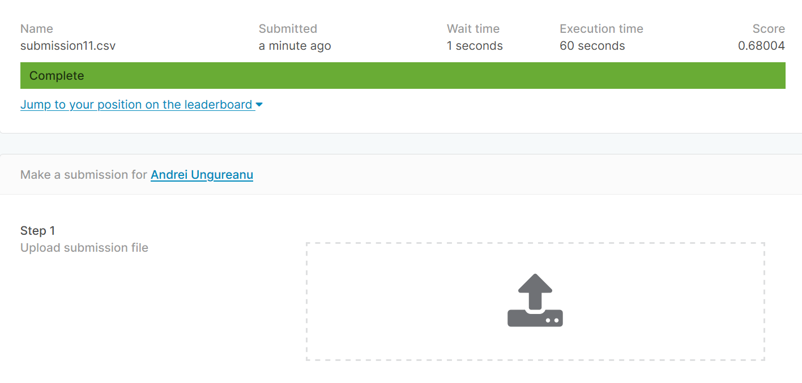

## Grasp-and-Lift EEG Detection Capstone Project
For successfully running this project notebooks you'll need to install numpy, sci-kit, torch and the MNE library (https://mne.tools/dev/index.html), which is used for analyzing human neurophysiological data.
The final kaggle submission can be viewed here:

The submitted file can be downloaded from this link:

https://www.dropbox.com/s/pmfziq3nex68r7h/submission11.7z?dl=1
